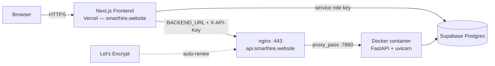

# SmartHire Backend — Resume Scorer API

FastAPI service that scores resumes against a job description using sentence-transformer embeddings, with an optional hybrid mode that blends in exact skill and category overlap.

**Live:** `https://api.smarthire.website` — AWS EC2 (eu-north-1, t3.micro, free tier) + Docker + nginx + Let's Encrypt. Deploy is currently manual (SSH in, `git pull` + `docker build` + `docker run`) — CD automation not wired up yet.

**Fallback:** [Render](https://smarthire-backend-icmj.onrender.com) (free tier) — kept alive, not actively used. See Rollback below.

## Run locally (venv)

```
python -m venv venv
venv\Scripts\activate
pip install -r requirements.txt
uvicorn main:app --reload --port 7860
```

## Run locally (Docker)

From the repo root (`e:\ubuntu-fyp`):

```
docker compose up
```

Serves on `http://localhost:8000`. Health check: `GET /health`.

## Endpoints

- `POST /score` — score all applications for a job (requires `X-API-Key` header)
- `POST /score-single` — score one resume against a job description
- `GET /score-status/{job_id}` — check scoring progress for a job
- `GET /health` — liveness check, no auth

## Tests

```
pytest tests/ -v
```

## CI

GitHub Actions runs lint (`ruff`) → test (`pytest`) → build (`docker build`) on every push/PR to `main`. `main` is branch-protected — all three must pass before a PR can merge.

## Architecture



- Frontend: Vercel, auto-deploys on push to `main` (permanent, not a fallback)
- Backend: single EC2 instance (t3.micro, eu-north-1), nginx terminates TLS and reverse-proxies to the Docker container on port 7860
- Both frontend and backend talk to Supabase directly — the backend doesn't sit between the frontend and the DB
- Cert renewal is automatic via certbot's systemd timer, no manual steps

## Rollback

If AWS becomes unavailable or credits run out:

1. Redeploy this same image to Render — `render.yaml` in this repo is already configured (`docker build` + `uvicorn` start command)
2. In Vercel's project settings, change `BACKEND_URL` to the Render URL
3. Redeploy the frontend (Vercel picks up the env var change)

No DNS changes needed — the frontend domain (`smarthire.website`) stays on Vercel throughout; `BACKEND_URL` is a server-side env var the frontend calls directly, not routed through `api.smarthire.website`.

## Environment variables

See `.env.example`. Required: `SUPABASE_URL`, `SUPABASE_SERVICE_ROLE_KEY`, `API_KEY`. Optional: `ALLOWED_ORIGINS`, `SCORING_MODE` (`semantic` or `hybrid`), `W_SEMANTIC`, `W_SKILL`, `W_CATEGORY`.
